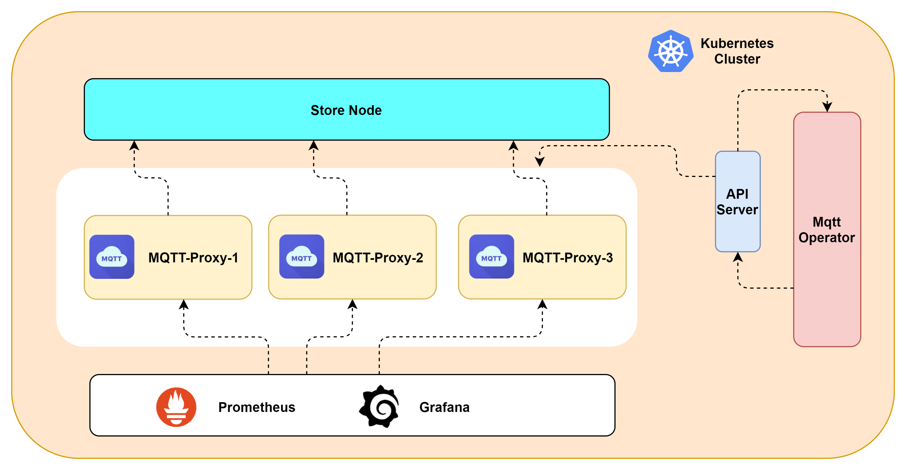

# mqtt-operator

#### Description
The mqtt operator is built using Kubebuilder. Currently, it supports the creation and deletion of mqtt proxy clusters, complete node lifecycle management, and is exposed to users in the form of a Service.
Currently, it supports deploying mqtt operators through YAML, and in the future, it will support deployment in the form of Helm.

#### Software Architecture
Software architecture description

#### Installation
Deploying the mqtt proxy cluster using YAML
1. Deploy CRD related files  
Kubectl apply - f mqtt proxy crd.yaml  
2. Deploy mqtt operator  
Kubectl apply - f mqtt operator.yaml  
3. Deploy the mqtt proxy cluster  
Kubectl apply - f mqtt proxy cr-yaml  

#### Instructions

1.  xxxx
2.  xxxx
3.  xxxx

#### Contribution

1.  Fork the repository
2.  Create Feat_xxx branch
3.  Commit your code
4.  Create Pull Request

## License

Copyright (c) 2023. China Mobile(SuZhou)Software Technology Co.,Ltd. All rights reserved.

 seecScanner is licensed under Mulan PSL v2.

You can use this software according to the terms and conditions of the Mulan PSL v2.
You may obtain a copy of Mulan PSL v2 at:

 http://license.coscl.org.cn/MulanPSL2

THIS SOFTWARE IS PROVIDED ON AN "AS IS" BASIS, WITHOUT WARRANTIES OF ANY KIND,
EITHER EXPRESS OR IMPLIED, INCLUDING BUT NOT LIMITED TO NON-INFRINGEMENT,
MERCHANTABILITY OR FIT FOR A PARTICULAR PURPOSE.
See the Mulan PSL v2 for more details.

