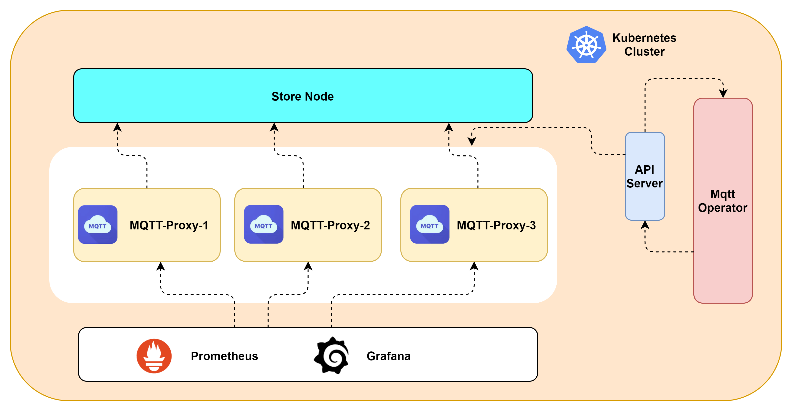

# mqtt-operator

#### 介绍
mqtt-operator使用Kubebuilder构建，目前mqtt-operator已支持mqtt-proxy集群的创建、删除，完整的节点生命周期管理，并通过Service的形式暴露给用户使用。
目前支持通过YAML来部署mqtt-operator，后续会支持 Helm 形式部署。

#### 软件架构
软件架构说明

#### 安装教程

使用YAML部署mqtt-proxy集群  

1、部署 CRD 相关文件  
kubectl apply -f mqtt-proxy-crd.yaml  

2、部署mqtt-operator  
kubectl apply -f mqtt-operator.yaml  

3、部署mqtt-proxy集群  
kubectl apply -f mqtt-proxy-cr.yaml

#### 使用说明

1.  xxxx
2.  xxxx
3.  xxxx

#### 参与贡献

1.  Fork 本仓库
2.  新建 Feat_xxx 分支
3.  提交代码
4.  新建 Pull Request

## License

Copyright (c) 2023. China Mobile(SuZhou)Software Technology Co.,Ltd. All rights reserved.

 seecScanner is licensed under Mulan PSL v2.

You can use this software according to the terms and conditions of the Mulan PSL v2.
You may obtain a copy of Mulan PSL v2 at:

 http://license.coscl.org.cn/MulanPSL2

THIS SOFTWARE IS PROVIDED ON AN "AS IS" BASIS, WITHOUT WARRANTIES OF ANY KIND,
EITHER EXPRESS OR IMPLIED, INCLUDING BUT NOT LIMITED TO NON-INFRINGEMENT,
MERCHANTABILITY OR FIT FOR A PARTICULAR PURPOSE.
See the Mulan PSL v2 for more details.

